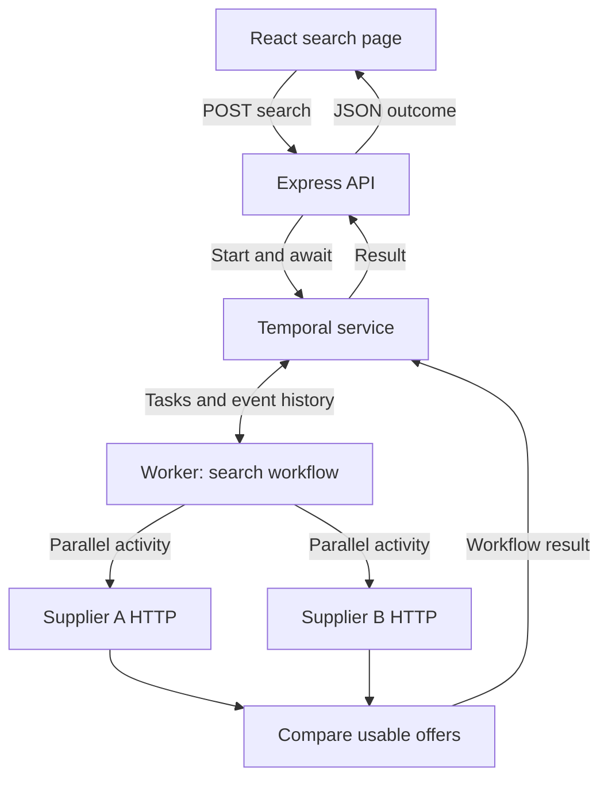

# Architecture

Status: Phase 0 baseline, updated factually as phases completed (Phases 1–5 implemented and verified; see Phases.md and Memory.md for current state).

## Phase 0 concrete selections — approval pending

Discovery on 2026-09-06 found Windows x64, Node 22.20.0 and npm 10.9.3. Select these installed runtime versions for the first reproducibility check, Temporal TypeScript SDK 1.23.0 (all SDK packages matched), Temporal CLI 1.8.3, and Vite 8.2.2. Registry metadata reports SDK Node >=20.3.0 and Vite Node ^20.19.0 or >=22.12.0; the released SDK README lists Node 22 support. These are compatible candidates, not an installed or tested application stack. Phase 1 must verify native worker loading, pin dependencies and CLI provenance, and write the exact lockfile. React, Tailwind, Express, Zod and test-tool patch versions will be resolved and pinned together in that phase.

Use CommonJS output for Node workspaces and shared server packages, with explicit package entrypoints; use Vite's ESM pipeline for the browser. Verify Vite consumption of shared contracts and Temporal workflow bundling during Phase 1 before feature work. Choose shadcn's Radix primitive variant consistently; no custom focus system is needed for the native date inputs.

Primary local setup command to implement and execute in Phase 1: `temporal server start-dev --ip 127.0.0.1 --port 7233 --ui-port 8233 --db-filename .temporal/dev.db`. Create the ignored data directory first. The CLI documentation verifies this syntax; the command has not been run because Temporal is absent from PATH. Docker is not a prerequisite. Its daemon was unreachable, and WSL distribution enumeration returned access denied in this session; neither is a verified fallback yet.

Prefer `TestWorkflowEnvironment.createLocal` with the pinned CLI for full-server workflow and real-clock integration tests. Use serial `createTimeSkipping` environments only for isolated orchestration tests where virtual time is appropriate. Native test-server startup remains a Phase 1/3 executable check, not an assumed Windows incompatibility. Do not combine a virtual workflow epoch with real HTTP deadline assertions.

Source correction: the cancellation-scopes prose describes `cancelRequested` as resolving, but the released 1.23.0 source declares `Promise<never>` and rejects it with `CancelledFailure`. Implement against the released API: observe rejection, retain the root scope, check root cancellation before aggregation returns, and rethrow its cancellation failure. A branch's deadline flag must never mask root cancellation. Preserve both scope and timer cleanup described below.

References: [released SDK README](https://github.com/temporalio/sdk-typescript/blob/v1.23.0/README.md), [released cancellation scope source](https://github.com/temporalio/sdk-typescript/blob/v1.23.0/packages/workflow/src/cancellation-scope.ts), [test environment API](https://typescript.temporal.io/api/classes/testing.TestWorkflowEnvironment), [CLI setup flags](https://docs.temporal.io/cli/command-reference/server). Resource access details are in Phases.md until the implementation resource audit is created.

## Stack and deployment shape

Use React + TypeScript + Vite, Tailwind CSS, shadcn/ui, Express, the official Temporal TypeScript SDK, Zod, native Node fetch, npm workspaces, Jest, Supertest, Testing Library and Playwright. Use a currently supported Node LTS version compatible with Temporal; verify the compatibility table at implementation time and pin the tested version. Keep all @temporalio packages on matching versions. Commit one root package-lock.json.

Four application processes: web :5173, API :3001, worker (no HTTP port required), mock suppliers :4001. Temporal dev server :7233 and its web UI :8233 are infrastructure. A local CLI dev server with persistent database file is the primary documented setup. Container setup is optional; do not require both. Include Windows PowerShell and macOS/Linux instructions verified on available platforms. Document WSL2/Linux fallback for any unsupported native Temporal test tooling.

## Data and execution flow

The Temporal service stores durable execution state. The worker executes workflow and activity code; the API's Temporal client starts and awaits that execution. The browser does not connect to Temporal or suppliers. Vite proxies `/api` to Express in local development; validate that abort/disconnect propagation works through this proxy.

## Repository ownership map

| Path                                                                          | Responsibility                                                                                                                                                                                                |
| ----------------------------------------------------------------------------- | ------------------------------------------------------------------------------------------------------------------------------------------------------------------------------------------------------------- |
| PRD.md, Architecture.md, Rules.md, Phases.md, Design.md                       | Approved project contract at repository root                                                                                                                                                                  |
| Memory.md                                                                     | Created only after first implementation task; current verified progress                                                                                                                                       |
| AGENTS.md                                                                     | Short pointer to governing documents and current phase; created during setup                                                                                                                                  |
| README.md                                                                     | Actual tested setup, scripts, examples, test mapping and limitations                                                                                                                                          |
| apps/web/src/App.tsx                                                          | Single search page composition                                                                                                                                                                                |
| apps/web/src/components/ui/                                                   | Generated shadcn primitives                                                                                                                                                                                   |
| apps/web/src/features/search/SearchForm.tsx                                   | Inputs and field validation feedback                                                                                                                                                                          |
| apps/web/src/features/search/SearchResult.tsx                                 | Best offer and partial-success display                                                                                                                                                                        |
| apps/web/src/features/search/SearchStatus.tsx                                 | Loading, empty, error and cancellation presentation                                                                                                                                                           |
| apps/web/src/features/search/useHotelSearch.ts                                | Request lifecycle, abort controller and stale-response guard                                                                                                                                                  |
| apps/web/src/lib/api.ts                                                       | Typed HTTP client; no business comparison                                                                                                                                                                     |
| apps/web/src/styles/globals.css                                               | Design tokens and global styles                                                                                                                                                                               |
| apps/web/public/icons/                                                        | Reviewed local SVG assets                                                                                                                                                                                     |
| apps/api/src/app.ts                                                           | Testable Express app factory                                                                                                                                                                                  |
| apps/api/src/server.ts                                                        | Listen and shutdown wiring                                                                                                                                                                                    |
| apps/api/src/routes/search-hotels.ts                                          | Validation, disconnect handling and HTTP mapping                                                                                                                                                              |
| apps/api/src/services/search-service.ts                                       | Start and await workflow through a reusable client                                                                                                                                                            |
| apps/api/src/temporal/client.ts                                               | Temporal connection lifecycle and client configuration                                                                                                                                                        |
| apps/api/src/middleware/error-handler.ts                                      | Safe, consistent unexpected-error responses                                                                                                                                                                   |
| apps/worker/src/worker.ts                                                     | Worker startup, registrations, shutdown                                                                                                                                                                       |
| apps/worker/src/workflows/search-hotels.workflow.ts                           | Parallel orchestration and result aggregation                                                                                                                                                                 |
| apps/worker/src/workflows/supplier-branch.ts                                  | Durable deadline and cancellation of one supplier branch                                                                                                                                                      |
| apps/worker/src/workflows/index.ts                                            | Workflow exports only                                                                                                                                                                                         |
| apps/worker/src/activities/fetch-supplier.ts                                  | HTTP, validation, heartbeat, abort and failure classification                                                                                                                                                 |
| apps/worker/src/activities/index.ts                                           | Activity registrations                                                                                                                                                                                        |
| apps/suppliers/src/app.ts, server.ts                                          | Separate mock supplier Express process                                                                                                                                                                        |
| apps/suppliers/src/routes/hotels.ts                                           | Both named mock endpoints                                                                                                                                                                                     |
| apps/suppliers/src/scenarios.ts                                               | Allowlisted behaviours, not arbitrary client scripts                                                                                                                                                          |
| apps/suppliers/src/fixtures.ts                                                | Synthetic hotel inventories by city                                                                                                                                                                           |
| packages/contracts/src/                                                       | Request/response schemas and serializable types; runtime hotel schemas are exported from the `@hotel/contracts/hotels` subpath entrypoint (hotels.d.ts stub + exports map) so zod never enters the web bundle |
| packages/domain/src/                                                          | Pure normalization, comparison and outcome aggregation                                                                                                                                                        |
| tests/unit/, suppliers/, activity/, workflow/, integration/, api/, web/, e2e/ | Tests separated by execution environment (e2e is the Playwright browser suite)                                                                                                                                |
| scripts/                                                                      | Portable setup/check/demo helpers; no duplicate business logic                                                                                                                                                |
| docs/third-party-assets.md                                                    | Icon provenance and applicable terms                                                                                                                                                                          |
| docs/resource-audit.md                                                        | Skills/docs read, revision, relevant rules and verified versions                                                                                                                                              |
| .github/workflows/ci.yml                                                      | Automated build and test gates                                                                                                                                                                                |

Each workspace has a package.json and appropriate tsconfig. Root owns shared TypeScript, lint, formatting and test configuration. Additional files are allowed only when they have a named responsibility and Architecture.md is updated in the same task. Do not create parallel `backend`, `server`, `api`, or `frontend` trees.

## Dependency boundaries

Contracts and domain are framework-independent. Domain receives normalized values and serializable inputs; it imports no React, Express or Temporal modules. Workflow code may import pure domain functions and type-only activity signatures. It must not import activity implementations, environment readers, HTTP libraries, Node built-ins, or supplier fixtures. Keep Zod validation on trust boundaries; shared schema modules must remain free of environment side effects. The web build must contain no Temporal client/worker dependencies or server secrets.

## Parallelism, deadlines and retries

1. Start A and B branches before awaiting either. Register the rejection handlers immediately. Collect bounded branch outcomes with Promise.allSettled or an equivalent cancellation-aware pattern. Never return the first response merely because it arrives first.
2. Each branch starts one normal activity governed by Temporal's retry policy. Use three maximum total attempts, initial retry interval 250 ms, coefficient 2, maximum interval 1 second. Immediate failures therefore have approximately 250 ms and 500 ms backoff before attempt three.
3. Give each branch its own durable five-second timer and cancellable activity scope. On deadline, mark that branch timed_out, request scope cancellation, and proceed without waiting indefinitely for its acknowledgement. Use the SDK's TRY_CANCEL activity cancellation mode. Cancel the unused timer on early completion. Settle or observe every losing promise so there are no leaked timers or unhandled rejections.
4. Pass a deadline epoch computed using workflow-safe time to the activity. Its Node fetch must abort when the remaining budget expires, including response body reading. Combine that deadline abort with Context.current().cancellationSignal. Retries reuse the original deadline, never reset the budget. An attempt that starts after the deadline must perform no HTTP call. This assumes synchronized clocks on the local machine; document clock skew as a distributed-deployment consideration.
5. Configure explicit Temporal safety timeouts behind the product deadline: initial design startToCloseTimeout 6 seconds, scheduleToCloseTimeout 6 seconds, heartbeatTimeout 1 second. These are crash/worker safety ceilings; the five-second durable branch timer and local HTTP abort own the product cutoff. Do not race two distinct five-second mechanisms and assert that history must always show only CANCELED or only TIMED_OUT.
6. Heartbeat immediately and periodically (target 250 ms); account for SDK heartbeat throttling when testing cancellation latency. Always clear heartbeat/abort timers and event listeners in finally. When the Temporal cancellation signal fires, preserve Temporal's cancellation failure instead of converting the fetch AbortError into a retryable network failure.
7. Retry network connection failures and HTTP 408, 429, 5xx only within policy and remaining budget. Treat malformed data, unexpected currency, most other 4xx, and exhausted product deadlines as non-retryable. An empty array is a successful result and is never retried.
8. Distinguish deadline-initiated branch cancellation from cancellation of the whole workflow. On search-wide cancellation, rethrow the SDK cancellation failure and end the workflow CANCELED, including when aggregation uses allSettled. Never turn cancellation into SUPPLIERS_UNAVAILABLE or normal success.
9. Disable automatic workflow retries; use workflowExecutionTimeout 15 seconds as the outer safety ceiling. Supplier failures return a typed business outcome, while unexpected programming exceptions remain defects. Awaiting the result must be bounded even if no worker is polling.

The exact helper implementation must be compiled and tested against the pinned SDK. Five seconds is a logical cutoff, not a real-time guarantee during process suspension or infrastructure outage. TRY_CANCEL requests cancellation without waiting for physical cleanup; live tests must separately prove local HTTP cleanup.

Official semantics: [activity timeouts and retries](https://docs.temporal.io/develop/typescript/activities/timeouts), [cancellation scopes](https://docs.temporal.io/develop/typescript/workflows/cancellation-scopes), and [activity cancellation signal](https://typescript.temporal.io/api/classes/activity.Context).

## Browser cancellation and API races

One browser AbortController per search. Cancel calls abort and transitions the UI to cancelled. Unmount also aborts. A monotonically increasing local request generation ensures old success, error, or finally callbacks cannot overwrite a newer search. Do not display a network failure for an intentional abort.

On Express, register response-disconnect handling before awaiting workflow start. Treat `res.close` with an unfinished response (`!res.writableEnded`, plus any needed finish-state guard) as a disconnect. Do not treat normal request-body completion or normal response closure as cancellation. Retain a disconnected flag while the Temporal start call is pending; as soon as it returns a handle, cancel that handle if the flag is set. Await/log cancellation failures without unhandled promises. Never write to a closed response. Treat cancellation racing with completion as an expected terminal race; do not terminate a workflow to implement ordinary user cancellation.

Use a server-generated opaque searchId/workflowId for correlation. Do not add a general unauthenticated endpoint that can cancel arbitrary workflow IDs. API start/connect RPCs need bounded deadlines and honest error mapping; handle an uncertain start outcome by cancelling the known workflowId when feasible, and retain the execution timeout as the final ceiling. Keep the client connection reused and close it on shutdown.

This design promises cancellation for the tested direct development path. Strong cross-proxy cancellation requires a separately designed authenticated search resource; do not silently claim it is already supported.

## Mock suppliers

Both GET endpoints accept validated city/check-in/check-out query fields and return `{ hotels: [{ hotelId, name, price }], currency: "AUD", priceBasis: "total_stay" }`.

Modes: normal, fast/slow delay under deadline, over-deadline delay (e.g. 8 seconds), hanging until client disconnect, empty, persistent 500, invalid payload, and fail-twice-then-success. Default A and B may have different fixed delays. No uncontrolled randomness in tests.

Use per-search scenario selection via a development/test-only allowlisted header or test fixture wiring. Phase 2 implements allowlisted headers `x-hotel-scenario` (normal, empty, server-error, delay, very-slow, hang, fail-twice, invalid-payload) and `x-supplier-attempt`; the activity forwards a trusted attempt number from Temporal activity info to mocks; fail-twice mode returns 500 for attempts 1 and 2 and succeeds for attempt 3. This avoids global mutable counters. Setting `SUPPLIER_SCENARIO_CONTROLS=disabled` ignores the headers. Never accept supplier URLs from users. Restrict scenario controls to local demo/test configuration, with no production passthrough. Mock delay/hang timers must stop on connection close.

## Test architecture

Jest node projects run domain, API, activity and workflow tests. A separate jsdom project runs React component tests. Use @temporalio/testing with an actual test server and Worker for workflow tests; use MockActivityEnvironment for isolated activity context tests. Do not mock away proxyActivities, retries, cancellation scopes or the workflow runtime in the tests claimed as workflow coverage.

Use Temporal time-skipping for orchestration and retry waits where supported, with serial or isolated time environments. Node HTTP timers are real time; they do not fast-forward with workflow time. Retain a real-clock integration suite for the five-second cutoff, heartbeat-driven cancellation and HTTP abort. Use barriers/events to prove concurrency rather than fragile elapsed-time-only assertions. Shut down workers, test servers and HTTP listeners after every suite. Reference: [Temporal test suite](https://docs.temporal.io/develop/typescript/best-practices/testing-suite).
