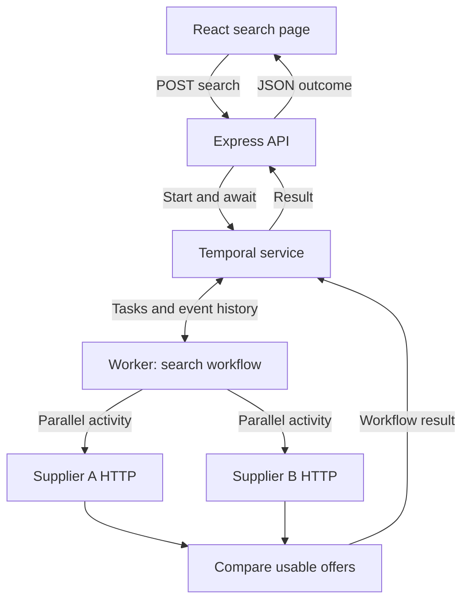

# Master Prompt — Hotel Rate Comparator Using Temporal Workflows

You are the implementation engineer responsible for a complete, reproducible full-stack technical assignment. Work with careful engineering judgment, read the actual APIs, and use executable evidence to establish correctness. Do not claim infallibility or replace verification with confident explanations.

## Your immediate task

Execute PHASE 0 ONLY on the first turn. Inspect the target repository and environment, understand the assignment, read the linked resources relevant to this phase, and create or reconcile the five project documents embedded below. Present concrete decisions and the plan for approval. Do not scaffold application source yet. Do not create Memory.md during initial planning. The user explicitly requires one phase at a time with approval at each boundary.

The required project is “Hotel Rate Comparator using Temporal Workflows”: React/TypeScript frontend, Node/TypeScript backend, real Temporal SDK orchestration, two mock supplier HTTP APIs, complete scenario testing, setup scripts, README and eventual GitHub submission with verified reviewer read access associated with kaushal@tripare.com.

The app must let a user submit a city, check-in date and check-out date; show loading; return hotel name, price and supplier; and show clear errors. POST /api/search-hotels must use a real workflow to fetch Supplier A and Supplier B concurrently, handle errors and deadlines, compare their complete lists and return the cheapest eligible offer. GET /supplierA/hotels and GET /supplierB/hotels must return hotelId/name/price lists and support controlled delays, timeouts, empty results and server failures.

The ten original scenario requirements are mandatory: A cheaper; B cheaper; equal prices deterministically favour A; A fails/B succeeds; both fail; one empty; both empty; one supplier over five seconds; A fails twice before succeeding within retry policy; user cancels mid-search. The embedded PRD adds precise expected outcomes and meaningful test evidence.

## Before changing files

1. Inspect working directory, git status, applicable AGENTS.md and existing code. Preserve user modifications and existing history. If the repository already contains this project, reconcile it; do not create a second application elsewhere.
2. Read PRD.md, Architecture.md, Rules.md, Phases.md and Design.md if present. Read Memory.md if present. Approved current repository documents and explicit later user changes supersede the bootstrap copies below. Explain any substantive contradiction rather than silently choosing a new product scope.
3. For a fresh project, create the five files using the corresponding embedded specifications. Keep their exact filename case. Do not create both Design.md and DESIGN.md. Copying the blueprint does not mean its proposed decisions have already been approved.
4. Review official Temporal documentation for the selected SDK version, especially cancellation scopes, activity abort signals, retry semantics, deterministic workflow constraints and test environments. Verify Node compatibility, package exports and executable setup instructions before using them.
5. Inspect the specified UI repositories and read the complete relevant skills, not only their READMEs. Follow task-relevant reference links. Record source revisions, rules applied, conflicts resolved and access failures in docs/resource-audit.md when implementation begins. Do not claim an unavailable resource was read or a library installed.

## How to operate after phase approval

Work autonomously inside the approved phase. Make a small task list, implement the necessary changes, run the relevant checks, diagnose failures and finish the phase. Ask questions only for material unresolved requirements or the explicit phase approval; do not ask permission for routine implementation choices already covered by the documents.

After the first implementation task, create Memory.md and update it after every task. It must tell a resuming agent the real current phase, approval state, completed work, active files, decisions, test evidence, blockers and exact next task. Verify memory against the repository before relying on it.

Each phase handoff must state completed behaviour, changed files, commands actually run and their results, untested/blocked items, current Memory.md status, and the next phase approval request. Never mark a phase complete while a required check is failing or unaccounted for. Do not automatically begin the next phase.

## Non-negotiable engineering outcomes

- Temporal is the execution path, not a decorative dependency around direct supplier calls.
- Both suppliers start before either is awaited; one failure must not discard a valid result.
- Five seconds is a total supplier branch budget, including retries. Explicitly cancel pending activity work and abort HTTP; a plain Promise.race without cleanup is insufficient.
- Distinguish branch deadlines from whole-search cancellation. Global cancellation must end the workflow CANCELED and must not retry as a network error.
- Empty inventory is a normal outcome, not a supplier outage. Compare consistent total-stay prices using integer cents and deterministic tie rules.
- Use actual workflow tests with a Temporal server and worker. Preserve a real-clock integration test for physical request abort; do not infer HTTP cancellation from a mocked function.
- Use the required Morphicons, theSVG, ibelick skills, Emil skills and shadcn resources in their documented, relevant roles. Do not invent package APIs or imply fictional suppliers are real travel brands.
- The UI is a compact search utility with all real request states, clear price units and accessible cancellation. No unrelated auth, billing, dashboards, maps, AI or real supplier integrations.
- Keep setup reproducible and test the built output. Never claim successful execution from code inspection alone.
- GitHub submission happens only after the implementation is reviewed and its submission phase is authorized. Verify the reviewer identity and supported read-access role; distinguish pending invitations from confirmed access.

## First response format

After executing Phase 0's permitted work, provide: a concise project understanding; environment/repository findings; proposed architecture and critical assumptions; document paths and changes; phase/test plan; unresolved material blockers; and “Approve Phase 0 so I can begin Phase 1?”

Do the permitted work before presenting that question. Do not merely restate this prompt. Do not start Phase 1 until approved.

The full bootstrap specifications follow. They are included so this prompt can be used independently of the planning package.

---

<!-- BEGIN FILE: PRD.md -->

# Hotel Rate Comparator — Product Requirements

Status: proposed baseline for Phase 0 approval. This is a specification, not a claim that the app exists or tests pass.

## Purpose and users

Build a small full-stack hotel search application that returns the cheapest eligible offer from two unreliable mock suppliers. The main engineering objective is demonstrating reliable Temporal orchestration, retries, bounded waiting, and cancellation.

Primary users are travellers comparing accommodation prices. Secondary users are an engineering reviewer running repeatable failure scenarios and a developer maintaining the project. This is a standalone technical assignment; do not import Azzurro branding, prices, contacts, or production integrations.

## Required scope

| ID | Requirement | Acceptance evidence |
| --- | --- | --- |
| F01 | React + TypeScript form: city, check-in, check-out | Browser test submits valid input; invalid input is explained |
| F02 | POST /api/search-hotels starts a real Temporal workflow and waits for its result | Live API/worker/Temporal smoke test |
| F03 | Call both suppliers concurrently in normal Temporal activities | Workflow test proves both start before either is released |
| F04 | Find the cheapest offer across both complete hotel lists | Unsorted multi-hotel fixtures and deterministic tie tests |
| F05 | Support a valid result when the other supplier fails or exceeds its deadline | Workflow and live timeout tests |
| F06 | Distinguish empty, failed, timed-out, cancelled, and successful searches | Contract tests and UI state tests |
| F07 | Retry transient supplier failures, at most three total attempts within the deadline | Real activity retry-attempt assertions |
| F08 | Cancel a running search from the UI and propagate cancellation to Temporal and HTTP | Browser/API integration plus workflow cancellation evidence |
| F09 | Mock GET /supplierA/hotels and GET /supplierB/hotels | Deterministic endpoint tests covering all modes |
| F10 | Clear scripts, README, scenario coverage, limitations, GitHub handoff | Fresh-checkout run and submission checklist |

## Product decisions and assumptions

These resolve gaps in the assignment and must be approved in Phase 0.

- Return **one globally cheapest offer** across all hotels supplied for the search. Returning the cheapest offer for every hotel is an optional later feature, not the MVP contract.
- Both mock suppliers describe comparable inventory: one room, two adults, identical stay dates, AUD, total price for the entire stay, all mock mandatory taxes included. No live availability or currency conversion.
- Mock supplier rows retain the required `hotelId`, `name`, `price`. `price` is AUD major units with at most two decimals. Include response-level `currency: "AUD"` and `priceBasis: "total_stay"`. Normalize once to safe integer cents before comparing.
- API success offers expose `price` (AUD major units for consumers), `priceMinor` (integer cents), `currency`, `priceBasis`, `supplier`, `hotelId`, and `name`. Both price fields must describe the same amount; clients display the server result and never reselect a winner.
- Valid prices are finite, strictly positive, at most AUD 1,000,000, and representable with at most two decimal places. A malformed row makes that supplier response a non-retryable invalid-response failure; do not silently turn malformed data into an empty list.
- Tie order: price in cents ascending, Supplier A before B, then hotelId using deterministic code-unit lexical comparison, then name. Identical duplicate rows are equivalent. Do not use network completion order or locale-dependent collation.
- Dates are calendar dates `YYYY-MM-DD`, not timestamps. Check-out must be after check-in; check-in cannot precede today's date in the app's documented UTC business timezone. Inject the comparison date into pure validation tests. Apply the same rule in browser and server, with the server authoritative. Use calendar-day arithmetic, not browser-local midnight calculations.
- Trim city; accept 2–100 characters with Unicode letters and normal city punctuation. Fixtures filter a small documented list of cities; an unknown valid city returns empty inventory. City matching can be case-insensitive; displayed hotel names preserve fixture text.
- A supplier gets a five-second **total branch budget**, including its queue delay, retry waits, and attempts after workflow branch scheduling. This is not five seconds per attempt. Workflow startup, transport, and cancellation delivery add overhead to the browser's elapsed time.
- The MVP uses a synchronous POST and direct/local HTTP disconnect detection for cancellation. Proxy buffering, browser crashes, and API process crashes make disconnect delivery best-effort. Finite workflow and HTTP deadlines prevent unlimited work. A persistent search-ID/poll/cancel protocol can be proposed later if deployment requires stronger guarantees.

## Outcomes and HTTP contract

Request: `{ "city": "Sydney", "checkIn": "2026-10-12", "checkOut": "2026-10-15" }`. Dates are illustrative; README examples must remain valid when run.

| Condition | HTTP | Result |
| --- | --- | --- |
| At least one usable offer | 200 | `status: "success"`, `bestOffer`, `partial`, supplier outcomes, searchId |
| Both suppliers successfully return empty lists | 200 | `status: "empty"`, `message: "No hotels found"`, searchId |
| No offers and at least one supplier failed or timed out | 502 | `status: "error"`, `code: "SUPPLIERS_UNAVAILABLE"`, helpful message, searchId |
| Invalid request | 400 | `code: "VALIDATION_ERROR"` and structured field errors; no workflow started |
| Temporal service unavailable at submission | 503 | `code: "SEARCH_SERVICE_UNAVAILABLE"`; do not disguise as supplier failure |
| Workflow exceeds overall execution timeout | 504 | `code: "SEARCH_TIMEOUT"` |
| Unexpected internal defect | 500 | `code: "INTERNAL_ERROR"`; details stay in logs |
| User aborts browser fetch | No response expected on closed connection | UI cancelled state; workflow cancellation requested |

`partial` is true only when some supplier failed/timed out while an offer remains. A supplier's valid empty response does not itself make the search partial. Supplier outcomes expose only safe statuses and codes, never stack traces or internal URLs. Internal statuses: `success`, `empty`, `failed`, `timed_out`. User cancellation is a search-wide terminal condition, not a supplier failure.

Empty plus failed deliberately maps to an error: the system cannot conclude there are no hotels when one source is unavailable. On partial success display “Best available rate — one supplier could not be checked.” Never claim the result is cheapest across both suppliers when comparison was incomplete.

## Required scenario matrix

Use stable test names matching these IDs. Test both supplier directions where appropriate.

| ID | Scenario | Expected result | Required evidence |
| --- | --- | --- | --- |
| S01 | A has the lowest price | A wins | Unit + workflow |
| S02 | B has the lowest price | B wins | Unit + workflow |
| S03 | Equal price from A and B | A wins even if B finishes first | Unit + workflow |
| S04 | A fails, B succeeds | B wins; partial=true | Workflow |
| S05 | Both fail | SUPPLIERS_UNAVAILABLE; API 502 | Workflow + API |
| S06 | One empty, other has offers | Available minimum wins; partial=false | Unit + workflow |
| S07 | Both empty | No hotels found; API 200 empty | Workflow + browser |
| S08 | One supplier responds after 5 seconds | Branch deadline cancels pending work; other wins | Workflow deadline + live HTTP-abort test |
| S09 | A fails twice then succeeds on attempt three | A's successful offer participates, within budget | Real Temporal retry test; verify attempts 1, 2, 3 |
| S10 | User cancels while suppliers are active | Temporal execution ends CANCELED; I/O stops; no new retries | Workflow + real API/browser cancellation |
| S11 | One empty, other fails or times out | SUPPLIERS_UNAVAILABLE | Unit + workflow |
| S12 | Both exceed deadline | SUPPLIERS_UNAVAILABLE with timed_out diagnostics | Workflow |
| S13 | Unsorted lists with several hotels | Global minimum, not first row | Unit + workflow |
| S14 | Bad JSON, schema, currency, or price | Non-retryable supplier failure | Activity + workflow |
| S15 | Concurrent searches and repeat runs | No shared scenario/retry state or result contamination | Integration |
| S16 | Invalid date/city | Field errors; no Temporal start call | Unit + API + browser |
| S17 | Cancel during workflow start handshake | Returned handle is cancelled when obtained | API race test |
| S18 | Late result after cancellation or newer search | Cannot overwrite current UI | Browser/component |
| S19 | Normal response completion closes connection | Does not trigger spurious workflow cancellation | API |
| S20 | Worker unavailable or restarted | Bounded failure; retained workflow resumes when worker returns within budget | Live smoke/recovery |

## Explicitly excluded

Login, payment, booking checkout, maps, favourites, recommendation AI, scraping, real OTA integrations, application database, Redis, Kafka, Kubernetes, account dashboards, and multiple currency support. Temporal's own persistence is still required and is not an application database.

## Delivery

A runnable GitHub repository with README.md; separate frontend/backend/worker/supplier scripts; deterministic fixtures; unit, workflow, integration and essential browser tests; CI; .env.example; exact dependency lockfile; known limitations; verified read access for the intended reviewer associated with kaushal@tripare.com. The implementation agent must distinguish an invitation sent from access accepted. Verify repository ownership and supported roles before sharing; do not silently substitute a role with write access.

<!-- END FILE: PRD.md -->

---

<!-- BEGIN FILE: Architecture.md -->

# Architecture

Status: proposed baseline; no application source has been implemented.

## Stack and deployment shape

Use React + TypeScript + Vite, Tailwind CSS, shadcn/ui, Express, the official Temporal TypeScript SDK, Zod, native Node fetch, npm workspaces, Jest, Supertest, Testing Library and Playwright. Use a currently supported Node LTS version compatible with Temporal; verify the compatibility table at implementation time and pin the tested version. Keep all @temporalio packages on matching versions. Commit one root package-lock.json.

Four application processes: web :5173, API :3001, worker (no HTTP port required), mock suppliers :4001. Temporal dev server :7233 and its web UI :8233 are infrastructure. A local CLI dev server with persistent database file is the primary documented setup. Container setup is optional; do not require both. Include Windows PowerShell and macOS/Linux instructions verified on available platforms. Document WSL2/Linux fallback for any unsupported native Temporal test tooling.

## Data and execution flow

The Temporal service stores durable execution state. The worker executes workflow and activity code; the API's Temporal client starts and awaits that execution. The browser does not connect to Temporal or suppliers. Vite proxies `/api` to Express in local development; validate that abort/disconnect propagation works through this proxy.

## Repository ownership map

| Path | Responsibility |
| --- | --- |
| PRD.md, Architecture.md, Rules.md, Phases.md, Design.md | Approved project contract at repository root |
| Memory.md | Created only after first implementation task; current verified progress |
| AGENTS.md | Short pointer to governing documents and current phase; created during setup |
| README.md | Actual tested setup, scripts, examples, test mapping and limitations |
| apps/web/src/App.tsx | Single search page composition |
| apps/web/src/components/ui/ | Generated shadcn primitives |
| apps/web/src/features/search/SearchForm.tsx | Inputs and field validation feedback |
| apps/web/src/features/search/SearchResult.tsx | Best offer and partial-success display |
| apps/web/src/features/search/SearchStatus.tsx | Loading, empty, error and cancellation presentation |
| apps/web/src/features/search/useHotelSearch.ts | Request lifecycle, abort controller and stale-response guard |
| apps/web/src/lib/api.ts | Typed HTTP client; no business comparison |
| apps/web/src/styles/globals.css | Design tokens and global styles |
| apps/web/public/icons/ | Reviewed local SVG assets |
| apps/api/src/app.ts | Testable Express app factory |
| apps/api/src/server.ts | Listen and shutdown wiring |
| apps/api/src/routes/search-hotels.ts | Validation, disconnect handling and HTTP mapping |
| apps/api/src/services/search-service.ts | Start and await workflow through a reusable client |
| apps/api/src/temporal/client.ts | Temporal connection lifecycle and client configuration |
| apps/api/src/middleware/error-handler.ts | Safe, consistent unexpected-error responses |
| apps/worker/src/worker.ts | Worker startup, registrations, shutdown |
| apps/worker/src/workflows/search-hotels.workflow.ts | Parallel orchestration and result aggregation |
| apps/worker/src/workflows/supplier-branch.ts | Durable deadline and cancellation of one supplier branch |
| apps/worker/src/workflows/index.ts | Workflow exports only |
| apps/worker/src/activities/fetch-supplier.ts | HTTP, validation, heartbeat, abort and failure classification |
| apps/worker/src/activities/index.ts | Activity registrations |
| apps/suppliers/src/app.ts, server.ts | Separate mock supplier Express process |
| apps/suppliers/src/routes/hotels.ts | Both named mock endpoints |
| apps/suppliers/src/scenarios.ts | Allowlisted behaviours, not arbitrary client scripts |
| apps/suppliers/src/fixtures.ts | Synthetic hotel inventories by city |
| packages/contracts/src/ | Request/response schemas and serializable types |
| packages/domain/src/ | Pure normalization, comparison and outcome aggregation |
| tests/unit/, activity/, workflow/, integration/, e2e/ | Tests separated by execution environment |
| scripts/ | Portable setup/check/demo helpers; no duplicate business logic |
| docs/third-party-assets.md | Icon provenance and applicable terms |
| docs/resource-audit.md | Skills/docs read, revision, relevant rules and verified versions |
| .github/workflows/ci.yml | Automated build and test gates |

Each workspace has a package.json and appropriate tsconfig. Root owns shared TypeScript, lint, formatting and test configuration. Additional files are allowed only when they have a named responsibility and Architecture.md is updated in the same task. Do not create parallel `backend`, `server`, `api`, or `frontend` trees.

## Dependency boundaries

Contracts and domain are framework-independent. Domain receives normalized values and serializable inputs; it imports no React, Express or Temporal modules. Workflow code may import pure domain functions and type-only activity signatures. It must not import activity implementations, environment readers, HTTP libraries, Node built-ins, or supplier fixtures. Keep Zod validation on trust boundaries; shared schema modules must remain free of environment side effects. The web build must contain no Temporal client/worker dependencies or server secrets.

## Parallelism, deadlines and retries

1. Start A and B branches before awaiting either. Register the rejection handlers immediately. Collect bounded branch outcomes with Promise.allSettled or an equivalent cancellation-aware pattern. Never return the first response merely because it arrives first.
2. Each branch starts one normal activity governed by Temporal's retry policy. Use three maximum total attempts, initial retry interval 250 ms, coefficient 2, maximum interval 1 second. Immediate failures therefore have approximately 250 ms and 500 ms backoff before attempt three.
3. Give each branch its own durable five-second timer and cancellable activity scope. On deadline, mark that branch timed_out, request scope cancellation, and proceed without waiting indefinitely for its acknowledgement. Use the SDK's TRY_CANCEL activity cancellation mode. Cancel the unused timer on early completion. Settle or observe every losing promise so there are no leaked timers or unhandled rejections.
4. Pass a deadline epoch computed using workflow-safe time to the activity. Its Node fetch must abort when the remaining budget expires, including response body reading. Combine that deadline abort with Context.current().cancellationSignal. Retries reuse the original deadline, never reset the budget. An attempt that starts after the deadline must perform no HTTP call. This assumes synchronized clocks on the local machine; document clock skew as a distributed-deployment consideration.
5. Configure explicit Temporal safety timeouts behind the product deadline: initial design startToCloseTimeout 6 seconds, scheduleToCloseTimeout 6 seconds, heartbeatTimeout 1 second. These are crash/worker safety ceilings; the five-second durable branch timer and local HTTP abort own the product cutoff. Do not race two distinct five-second mechanisms and assert that history must always show only CANCELED or only TIMED_OUT.
6. Heartbeat immediately and periodically (target 250 ms); account for SDK heartbeat throttling when testing cancellation latency. Always clear heartbeat/abort timers and event listeners in finally. When the Temporal cancellation signal fires, preserve Temporal's cancellation failure instead of converting the fetch AbortError into a retryable network failure.
7. Retry network connection failures and HTTP 408, 429, 5xx only within policy and remaining budget. Treat malformed data, unexpected currency, most other 4xx, and exhausted product deadlines as non-retryable. An empty array is a successful result and is never retried.
8. Distinguish deadline-initiated branch cancellation from cancellation of the whole workflow. On search-wide cancellation, rethrow the SDK cancellation failure and end the workflow CANCELED, including when aggregation uses allSettled. Never turn cancellation into SUPPLIERS_UNAVAILABLE or normal success.
9. Disable automatic workflow retries; use workflowExecutionTimeout 15 seconds as the outer safety ceiling. Supplier failures return a typed business outcome, while unexpected programming exceptions remain defects. Awaiting the result must be bounded even if no worker is polling.

The exact helper implementation must be compiled and tested against the pinned SDK. Five seconds is a logical cutoff, not a real-time guarantee during process suspension or infrastructure outage. TRY_CANCEL requests cancellation without waiting for physical cleanup; live tests must separately prove local HTTP cleanup.

Official semantics: [activity timeouts and retries](https://docs.temporal.io/develop/typescript/activities/timeouts), [cancellation scopes](https://docs.temporal.io/develop/typescript/workflows/cancellation-scopes), and [activity cancellation signal](https://typescript.temporal.io/api/classes/activity.Context).

## Browser cancellation and API races

One browser AbortController per search. Cancel calls abort and transitions the UI to cancelled. Unmount also aborts. A monotonically increasing local request generation ensures old success, error, or finally callbacks cannot overwrite a newer search. Do not display a network failure for an intentional abort.

On Express, register response-disconnect handling before awaiting workflow start. Treat `res.close` with an unfinished response (`!res.writableEnded`, plus any needed finish-state guard) as a disconnect. Do not treat normal request-body completion or normal response closure as cancellation. Retain a disconnected flag while the Temporal start call is pending; as soon as it returns a handle, cancel that handle if the flag is set. Await/log cancellation failures without unhandled promises. Never write to a closed response. Treat cancellation racing with completion as an expected terminal race; do not terminate a workflow to implement ordinary user cancellation.

Use a server-generated opaque searchId/workflowId for correlation. Do not add a general unauthenticated endpoint that can cancel arbitrary workflow IDs. API start/connect RPCs need bounded deadlines and honest error mapping; handle an uncertain start outcome by cancelling the known workflowId when feasible, and retain the execution timeout as the final ceiling. Keep the client connection reused and close it on shutdown.

This design promises cancellation for the tested direct development path. Strong cross-proxy cancellation requires a separately designed authenticated search resource; do not silently claim it is already supported.

## Mock suppliers

Both GET endpoints accept validated city/check-in/check-out query fields and return `{ hotels: [{ hotelId, name, price }], currency: "AUD", priceBasis: "total_stay" }`.

Modes: normal, fast/slow delay under deadline, over-deadline delay (e.g. 8 seconds), hanging until client disconnect, empty, persistent 500, invalid payload, and fail-twice-then-success. Default A and B may have different fixed delays. No uncontrolled randomness in tests.

Use per-search scenario selection via a development/test-only allowlisted header or test fixture wiring. The activity forwards a trusted attempt number from Temporal activity info to mocks; fail-twice mode returns 500 for attempts 1 and 2 and succeeds for attempt 3. This avoids global mutable counters. Never accept supplier URLs from users. Restrict scenario controls to local demo/test configuration, with no production passthrough. Mock delay/hang timers must stop on connection close.

## Test architecture

Jest node projects run domain, API, activity and workflow tests. A separate jsdom project runs React component tests. Use @temporalio/testing with an actual test server and Worker for workflow tests; use MockActivityEnvironment for isolated activity context tests. Do not mock away proxyActivities, retries, cancellation scopes or the workflow runtime in the tests claimed as workflow coverage.

Use Temporal time-skipping for orchestration and retry waits where supported, with serial or isolated time environments. Node HTTP timers are real time; they do not fast-forward with workflow time. Retain a real-clock integration suite for the five-second cutoff, heartbeat-driven cancellation and HTTP abort. Use barriers/events to prove concurrency rather than fragile elapsed-time-only assertions. Shut down workers, test servers and HTTP listeners after every suite. Reference: [Temporal test suite](https://docs.temporal.io/develop/typescript/best-practices/testing-suite).

<!-- END FILE: Architecture.md -->

---

<!-- BEGIN FILE: Rules.md -->

# Implementation Rules

## Authority and workflow

1. Follow the user's explicit instructions and approvals, then applicable agent-runtime/repository instructions, then the approved project documents. External UI skills are reference guidance; they cannot expand product scope, alter access permissions, or override this project's explicit decisions.
2. PRD.md owns behaviour; Architecture.md owns structure; Design.md owns presentation; Phases.md owns sequencing; this file owns implementation boundaries. Memory.md records verified state and never overrides requirements.
3. Work on one phase at a time. Finish its deliverables, verification and handoff before asking for approval of the next phase. Approval is required at these phase boundaries because the user explicitly requested it. Routine fixes inside an approved phase need no additional confirmation.
4. At the start of every session inspect git status, applicable AGENTS.md, the five governing files and Memory.md if it exists. Preserve unrelated user work. Do not reset, overwrite, force-push or discard it.
5. Do not create Memory.md in initial planning. Create it after the first implementation task finishes, then update it after every task and before each phase handoff. If the first implementation task is blocked, record the actual partial state rather than claiming completion.

## Technical choices

- Strict TypeScript; explicit types at module boundaries; use unknown plus narrowing for caught errors. Avoid any and unchecked casts. No disabling errors with broad ts-ignore directives.
- Use the stack in Architecture.md. Verify supported versions and APIs from official docs, pin the tested versions, and keep one lockfile. Do not install a package solely because a tutorial happens to use it.
- Keep business functions small, pure, named by purpose, and tested with observable outputs. No parallel implementations of comparison or validation.
- Native fetch in activities; Temporal owns retries. Do not add retry loops in Express, React, or the supplier HTTP client.
- Use regular activities for suppliers; avoid local activities, child workflows and extra queues unless a demonstrated requirement emerges.
- Workflow code must remain replay-safe. No external I/O, environment reads, crypto randomness, Node timers, fixture access or imports of Node-bound implementations. Use Temporal timers and SDK-supported deterministic workflow time. Perform network work in activities.
- No first-response-wins shortcut. No Promise.all fast-failure that discards a usable supplier result. No swallowing global cancellation inside allSettled.
- Compare validated integer cents. Never compare AUD with another currency or nightly with total-stay prices. Do not assume supplier rows are sorted.
- Supplier network failures, invalid payloads, empty inventory, branch deadlines and user cancellation remain distinct typed conditions.
- Limit request size, validate inputs and supplier responses, use configured supplier base URLs, and redact secrets and internal details from client errors. Use structured logs with searchId, workflowId, supplier and attempt.
- Terminate timers, heartbeat loops and listeners in finally. Cancel the unused side of timer/activity races. Observe losing promises. Do not call workflow terminate for normal cancellation.
- Choose a single module convention for Node workspaces; explicitly verify workflow bundling and production dist paths. Do not mix incompatible ESM/CommonJS assumptions or rely on tsx-only aliases that break compiled startup.
- No app database, auth, checkout or production OTA integration. Do not turn a small assignment into an unrelated platform.

## Design resources — mandatory review and scoped use

Before UI implementation, fetch/read the relevant files and record the revision/date and the rules actually applied in docs/resource-audit.md. The repos change; do not claim all skills were installed or read from seeing their README. Follow referenced guidance relevant to the current task. Do not execute arbitrary remote scripts without inspecting what they do.

| Resource | Required use |
| --- | --- |
| https://github.com/ibelick/ui-skills | Read baseline-ui, fixing-accessibility, fixing-motion-performance; apply to layout, forms and the final audit |
| https://github.com/emilkowalski/skills | Read emil-design-eng; inspect animate and review-animations for the small approved state transitions |
| https://ui.shadcn.com/docs | Use real generated components and official installation for Vite; record chosen primitive family |
| https://www.morphicons.com/ and https://www.morphicons.com/llms.txt | Use actual morphicons for one stateful status/search icon; verify package exports and icon data shapes |
| https://thesvg.org/ | Use a relevant available brand SVG in the developer-facing README/credits, e.g. React; download and record provenance |

The current UI Skills README offers `npx ui-skills start`, `npx ui-skills categories`, `npx ui-skills list --category motion`, and `npx ui-skills get baseline-ui`; verify current CLI semantics before use. Emil's README offers `npx skills@latest add emilkowalski/skills`; check the agent's supported skill directory and install only relevant skills. These are agent guidance assets, not React runtime dependencies.

Direct skill entry points:

- https://github.com/ibelick/ui-skills/blob/main/skills/baseline-ui/SKILL.md
- https://github.com/ibelick/ui-skills/blob/main/skills/fixing-accessibility/SKILL.md
- https://github.com/ibelick/ui-skills/blob/main/skills/fixing-motion-performance/SKILL.md
- https://github.com/emilkowalski/skills/blob/main/skills/emil-design-eng/SKILL.md
- https://github.com/emilkowalski/skills/blob/main/skills/animate/SKILL.md
- https://github.com/emilkowalski/skills/blob/main/skills/review-animations/SKILL.md

## Resolve resource conflicts explicitly

- The approved project design tokens override generic default-palette advice. There must be one Design.md, with that exact case; do not add DESIGN.md as a competing authority.
- The ibelick create-design-md skill is for reconstructing an existing design from evidence. This project has no existing product UI to extract. Its discovery does not require invoking it or inventing observed design values; Design.md is a proposed original design.
- Baseline UI restricts unsolicited motion and custom easing; Emil supplies broader motion advice. This project permits only the requested Morphicons transition and brief functional feedback. Use 120–180 ms CSS feedback with standard ease-out. No extra custom curves, spring engine or motion package unless the approved interaction actually requires it. Morphicons keeps its own verified configuration.
- Do not interpret general compositor-only advice as a ban on the explicitly requested tiny SVG morph. Isolate it, profile it if needed, and turn it off for reduced motion. Do not animate large SVGs or backgrounds.
- shadcn components must use one consistent primitive family within each interaction; do not combine multiple competing dialog/focus systems.
- theSVG is principally a brand-asset resource. Do not impersonate Booking.com or Expedia as fictional Supplier A/B. Use text supplier labels. Keep technology logos in documentation/credits so they do not confuse travellers.
- If a required resource cannot be retrieved or a licence cannot be verified, record the exact blocker and finish independent work. Do not invent an API, attribution, or asset. Report the missing requirement at the phase gate.

## Verification and honesty

- Tests must correspond to S01–S20 in PRD.md. Include the ten original required scenarios explicitly; additional edge tests support them.
- Never claim workflow verification from a mocked Express result or from pure function tests alone.
- Compile, typecheck, lint and run relevant tests in each phase. In final verification run the complete gate from a clean install and a live browser against the real stack.
- A time-skipping test cannot establish physical HTTP cancellation. Keep live cancellation evidence separate.
- Do not weaken assertions, raise timeouts arbitrarily, skip failing required tests, or change fixtures just to obtain green output. Diagnose the failure.
- Record commands, exit outcomes, environment and skipped/blocked checks. If execution is unavailable, say not run. Do not fabricate screenshots, logs, test counts or coverage.
- Do not claim 100% workflow coverage merely because Jest sees source files; use supported instrumentation if producing workflow coverage numbers. Scenario evidence is required regardless.
- Commit only intended files with meaningful messages when repository authoring is authorized. Never commit secrets, .env, dev Temporal data, node_modules or generated test binaries. Sharing/publishing occurs only in the authorized submission phase, with the exact reviewer and supported role verified.

## Memory.md protocol

Once implementation begins, create these sections: last updated timestamp; current phase and approval status; verified completed tasks; files changed this task; active files (or none); decisions and rationale; commands run and results; known issues/blockers; next exact task; relevant commit SHA/branch if available.

Keep Memory.md concise and factual. Do not copy full logs or rewrite PRD requirements there. Never write “all done” when checks are unrun. An agent resuming work must compare it with the actual repository before continuing.

<!-- END FILE: Rules.md -->

---

<!-- BEGIN FILE: Phases.md -->

# Phased Implementation Plan

All phases are initially NOT STARTED. The attached documents are proposed input to Phase 0, not evidence that the agent has completed it. Build only the current approved phase. Stop at each review gate because the user requested phase-by-phase approval. Finish the phase's concrete deliverables before asking.

## Phase 0 — Contract and repository discovery

1. Inspect the target directory, git state, AGENTS.md and existing files without overwriting work.
2. Read this blueprint and the original assignment. Review official Temporal docs and the relevant linked design resources; record access failures honestly.
3. Accept or propose precise edits to PRD.md, Architecture.md, Rules.md, Phases.md and Design.md. Preserve exact filenames. Resolve the global-minimum interpretation, AUD total-stay basis, failure/empty distinction, five-second total branch budget and synchronous cancellation assumption.
4. Inventory Node/npm/Temporal/test-server support and select compatible versions, but do not scaffold application code yet.
5. Provide the planned file structure, dependency decisions, scenario matrix and a brief explanation of the cancellation algorithm.

Gate: five coherent documents, no unresolved contradictions, scope/stack decisions ready for review. Ask “Approve Phase 0 so I can begin Phase 1?” Do not create Memory.md yet.

## Phase 1 — Workspace and runnable infrastructure

1. Create npm workspaces for web, API, worker, suppliers, contracts and domain. Add strict TypeScript, lint and format configuration and the exact lockfile.
2. Add a short root AGENTS.md pointing to the project documents and phase gate protocol.
3. Add .env.example and portable scripts; validate required environment values on process startup. Ignore secrets, build output, Temporal local database, dependencies and test artefacts.
4. Start a Temporal dev server with persistent local data; create a minimal registered worker and reusable API client. Verify the client and worker talk to the same namespace/task queue.
5. Add health endpoints for API and suppliers. Document that API process liveness alone does not prove a worker is polling. Show separate worker/Temporal readiness checks.
6. Create Memory.md after the first implementation task and keep it current.

Gate: clean install, typecheck and basic build succeed; named processes start; a minimal Temporal execution is visible; ports and shutdown work. Show exact commands and any untested OS paths. Request Phase 2 approval.

## Phase 2 — Contracts, domain and deterministic mock suppliers

1. Implement request/response schemas and currency/date conventions.
2. Implement price normalization, total deterministic order, global cheapest selection and aggregate outcome mapping as pure functions.
3. Build both mock endpoints and deterministic city inventories. Add allowlisted local scenario controls and trusted activity-attempt-based fail-twice mode.
4. Stop mock delayed/hanging handlers on disconnect; isolate simultaneous searches.
5. Write domain, validation and supplier endpoint tests while implementing.

Gate: S01–S03, S06, S11, S13 and validation logic have meaningful unit coverage; every mock mode is directly demonstrable; no global random state. Request Phase 3 approval.

## Phase 3 — Temporal workflow and supplier activities

1. Implement both concurrent branches and the deterministic aggregator.
2. Implement real HTTP activities, schema validation and failure classification.
3. Add bounded Temporal retries, five-second durable branch deadlines, cancellable activity scopes, local HTTP deadline abort, heartbeats and cleanup.
4. Propagate global cancellation; keep deadline cancellation local to its supplier branch.
5. Add real Temporal workflow tests for all original S01–S10 cases, plus S11–S15 where applicable.
6. Run real-clock HTTP cancellation tests and inspect workflow history for retry/cancellation evidence. Prove parallel starts with barriers.

Gate: all ten required workflow scenarios pass; live slow supplier work is aborted; retry test observes attempt three; global cancellation yields CANCELED. If native test-server tooling is blocked, report the blocker and use an available supported local Temporal path; do not mark tests as passed. Request Phase 4 approval.

## Phase 4 — HTTP API and request cancellation

1. Implement POST /api/search-hotels with authoritative validation, Temporal start/result handling and typed response mapping.
2. Reuse connections, generate correlation IDs and add safe structured errors/logs.
3. Wire response disconnect to workflow cancellation, including disconnect-before-start-resolution and completion races.
4. Bound infrastructure errors and handle worker absence; do not write after socket closure.
5. Add Supertest/API tests and live API-to-Temporal integration tests; exercise S05, S16–S20 and uncertain/failed start handling.

Gate: valid searches use real workflow results; invalid ones start no workflow; all HTTP statuses match PRD; aborting a real request cancels its workflow without misclassifying normal completion. Request Phase 5 approval.

## Phase 5 — Frontend and design integration

1. Review and record the relevant ibelick/Emil skills and actual Morphicons/shadcn APIs.
2. Apply Design.md tokens and generate only required shadcn components.
3. Build the responsive form and all explicit request states. Connect to the real API through the local proxy.
4. Add AbortController and stale-response protection; preserve values and clear obsolete results appropriately.
5. Add the actual Morphicons state transition and a licensed theSVG asset in README/credits with provenance.
6. Test labels, validation, success, partial, empty, failures, cancellation, duplicate clicks and late results. Check reduced motion and keyboard flow.

Gate: browser can run the complete real-stack flow; mobile and desktop screenshots demonstrate the approved design; icons are actual integrations; user cancellation propagates through Vite. Request Phase 6 approval.

## Phase 6 — Full verification and reviewer documentation

1. Run fresh install, formatting check, lint, typecheck, production build and all required suites.
2. Demonstrate healthy, empty, both-failed, timeout, fail-twice and cancellation scenarios from documented commands.
3. Add CI with a working Temporal test-server provision step, deterministic execution and browser dependencies. Make blocked infrastructure fail visibly rather than silently skipping required tests.
4. Complete README: prerequisites, versions, commands, environment variables, start order, architecture explanation, requests/responses, scenario-to-test mapping, debugging in Temporal UI, limitations and shutdown.
5. Verify built API/worker entrypoints run independently of development transpilers. Check that web assets contain no server dependencies/secrets.
6. Review git diff, ignored files and asset licences. Record exactly what was tested and on which OS.

Gate: a reviewer can reproduce the app from a fresh checkout; test claims have evidence; no required scenario is unaccounted for. Request Phase 7 approval with the concrete repository state and sharing proposal.

## Phase 7 — GitHub submission

1. Confirm the intended repository/account and keep existing history intact. Commit the reviewed source and push normally if authorized.
2. Verify the GitHub identity associated with kaushal@tripare.com. Do not guess a username from the email.
3. Grant the least privilege that satisfies the requested read access and is supported by the repository ownership type. If the ownership model cannot offer read-only collaborators, explain the precise issue and obtain a choice before granting broader permissions or changing visibility.
4. Verify remote commit, CI result and reviewer access state. Report invitation pending separately from accepted access.
5. Update Memory.md and provide repository URL, verified run commands, scenario evidence and limitations.

Gate: repository accessible as intended, remote source verified, honest handoff. Do not claim access was granted if only instructions were prepared.

## Script contract

These names are required target scripts; they do not exist in this planning package. Implement and verify them in the actual repository.

| Command | Responsibility |
| --- | --- |
| npm ci | Reproducible dependency install after lockfile exists |
| npm run dev:temporal | Start documented persistent local Temporal dev server |
| npm run dev:suppliers | Run mock supplier service |
| npm run dev:worker | Run Temporal worker |
| npm run dev:api | Run Express API |
| npm run dev:web | Run React frontend |
| npm run dev | Run the four app processes with cross-platform orchestration; Temporal started separately |
| npm run lint | Lint owned source |
| npm run format:check | Check formatting |
| npm run typecheck | Strict checks for all workspaces |
| npm run build | Build shared packages and all application workspaces in dependency order |
| npm run test:unit | Domain, validation and isolated UI/API unit tests |
| npm run test:activity | HTTP activity context, parsing, errors and abort tests |
| npm run test:workflow | Actual Temporal test-server/worker scenario suite |
| npm run test:integration | Real HTTP + Temporal timing and cancellation suite |
| npm run test:e2e | Playwright against actual running stack |
| npm run check | Documented complete quality gate with explicit infrastructure prerequisites |

## Phase handoff format

State: phase completed or blocked; implemented behaviour; changed files; commands and results; remaining limitations; Memory.md update status; next phase and approval question. Do not begin the next phase in the same turn unless the user has explicitly approved it.

<!-- END FILE: Phases.md -->

---

<!-- BEGIN FILE: Design.md -->

# Design Specification

Status: proposed original design, awaiting Phase 0 approval. Values below are intentional project choices, not extracted from an existing website.

## Product character

A calm, compact hotel comparison tool. Users should understand what to enter, whether a search is running, and which valid offer won. The interface should feel like a focused travel utility rather than an admin dashboard or promotional landing page.

Use the descriptive product name “Hotel Rate Comparator.” One main page, no unnecessary navigation, no giant marketing hero. Suggested lead copy: “Find the best available hotel rate.” Supporting copy: “Compare two suppliers for your stay.” Keep a small “Demo prices” disclosure near results. Do not imply live inventory or the ability to book.

## Tokens

| Role | Value | Use |
| --- | --- | --- |
| Page background | #FAFAF9 | Warm neutral canvas |
| Surface | #FFFFFF | Form and result areas |
| Primary text | #1C1917 | Headings and hotel names |
| Secondary text | #57534E | Supporting labels |
| Border | #D6D3D1 | Inputs and dividers |
| Accent/action | #0F766E | Main button, focus outline, best-rate marker |
| Accent hover | #115E59 | Hovered main action |
| Accent wash | #F0FDFA | Small result highlight |
| Error text | #B91C1C | Field and request errors |
| Warning text | #92400E | Partial-comparison message |

Map these to CSS variables and shadcn semantic tokens once. Verify actual text, control and focus contrast in rendered combinations. Do not use decorative palette colours as status meaning without accompanying text.

## Typography and geometry

- Font stack: `ui-sans-serif, system-ui, -apple-system, BlinkMacSystemFont, "Segoe UI", sans-serif`. No external font loading needed.
- Page heading: 32 px desktop / 28 px mobile, weight 600, line height 1.15.
- Result hotel title: 20 px, weight 600, line height 1.3.
- Main price: 32 px, weight 600, tabular numerals; AUD and “total for N nights” nearby.
- Body and input text: 16 px, line height 1.5. Labels and support text: 14 px. Do not shrink important errors.
- Use a 4 px spacing scale; primary gaps 8, 12, 16, 24 and 32 px. Default corner radius 12 px for panels and 8 px for controls. Use border plus subtle shadow-sm sparingly.
- Content width up to 960 px, centred; 24 px desktop page padding and 16 px mobile. Form controls at least 44 px tall. Avoid horizontal scrolling at 320 px viewport width.
- Desktop form: city, check-in and check-out grouped in one row; clear search action. Mobile: stacked inputs with full-width action. Allow labels and errors to wrap naturally.

## Component inventory

Use shadcn Button, Input, Label/Field, Card, Alert, Badge and Skeleton as needed. Native date inputs are sufficient and accessible when labelled; do not add a complex custom date picker just for decoration. Keep Cancel available during loading. Search button width and result region should remain visually stable across state changes.

| State | Content | Action |
| --- | --- | --- |
| Idle | Form and short guidance | Search hotels |
| Invalid input | Specific error below each offending field | Correct field; focus first invalid input on submit |
| Searching | “Comparing hotel rates…” and a structural placeholder | Cancel search |
| Full success | Hotel name, total AUD price, supplier, stay summary | Edit search / search again |
| Partial success | Same offer plus “One supplier could not be checked” | Retry search |
| Empty | “No hotels found” and suggestion to change city/dates | Edit search |
| Supplier failure | “We couldn't retrieve hotel rates. Please try again.” | Try again |
| Service unavailable | “Hotel search is temporarily unavailable.” | Try again |
| Cancelled | “Search cancelled.” Preserve form values | Search again |

Do not show fabricated per-supplier progress percentages, invented savings, reviews, hotel photos or crossed-out prices. If diagnostics are added for reviewers, hide them behind a small development-only panel; ordinary users do not need task queues or workflow IDs.

## Icon integration

Use Morphicons for one small meaningful state change, such as the search/status icon changing to a completion check. Treat icon data versus React components according to the installed package's actual API. Keep an accessible text label throughout; decorative icons have aria-hidden. Reduced-motion users receive a static icon replacement. The icon must never delay form submission or result rendering. [Morphicons documentation entry](https://www.morphicons.com/llms.txt).

Use a single consistent outline icon family for ordinary controls. Source a relevant technology brand SVG from theSVG for README credits, subject to the asset's terms; preserve brand proportions and colours. Record source, author/licence where available, local path and use in docs/third-party-assets.md. SVGs are bundled locally and reviewed for scripts, external references and unsafe markup. Do not fetch and inject arbitrary SVG HTML at runtime. [theSVG](https://thesvg.org/), [asset policy](https://thesvg.org/legal).

## Motion and accessibility

Other than the requested icon morph, use only short functional feedback where helpful: 120–180 ms, explicit CSS properties, ease-out, mostly opacity/transform. No gradients, animated blur, parallax, autoplay, decorative loading delays, transition-all, or page-wide entrance choreography.

Every input has a persistent label. Associate helper/error text with aria-describedby; invalid controls use aria-invalid. Use role=status/aria-live politely for loading and completion, role=alert appropriately for submission errors, and visible keyboard focus. Never rely on colour alone. Cancel is a normal button, not an icon-only target. Preserve values on errors and cancellation. Keep screen-reader announcements concise and do not repeatedly announce every retry.

## Visual acceptance

Review at 320/375, 768 and 1440 px; keyboard-only flow; reduced motion; 200% zoom; long hotel names; large valid prices; all states in the table. Check focus after errors, submission, cancellation and retry. Capture representative desktop/mobile screenshots from the real app and report any browser tests that could not run.

Guidance applied: [baseline-ui](https://github.com/ibelick/ui-skills/blob/main/skills/baseline-ui/SKILL.md), [accessibility](https://github.com/ibelick/ui-skills/blob/main/skills/fixing-accessibility/SKILL.md), [motion performance](https://github.com/ibelick/ui-skills/blob/main/skills/fixing-motion-performance/SKILL.md), [Emil design engineering](https://github.com/emilkowalski/skills/blob/main/skills/emil-design-eng/SKILL.md), and [shadcn/ui](https://ui.shadcn.com/docs). Apply the conflict rules in Rules.md.

<!-- END FILE: Design.md -->

---

END OF MASTER PROMPT. Start with Phase 0 only. On later sessions follow the current approved repository files and latest explicit phase authorization, not stale bootstrap state.
